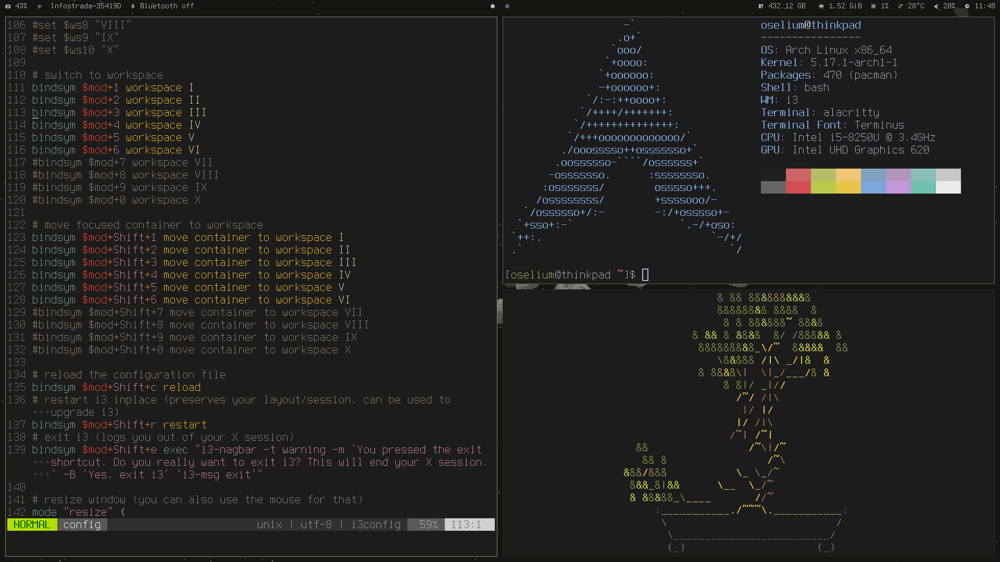

# ~/.config

Personal dotfiles, mostly taken from [listout](https://gitlab.com/listout/dots)

## Application list

| Apps                 | I use                 |
| -------------------- | --------------------- |
| Window Manager       | i3-gaps               |
| Bar                  | Polybar               |
| Compositor           | Picom                 |
| Application Launcher | Rofi                  |
| Terminal             | Alacritty             |
| Text Editor          | Vim                   |
| Filemanager          | Ranger                |
| Web browser          | Firefox               |
| Pdf Reader           | Zathura               |
| Wallpaper            | [spacesurf](images/spacesurf_modified.png)  |

## Fonts

- [Terminus](http://terminus-font.sourceforge.net)
- [Siji icons](https://github.com/stark/siji)

## Key bindings

| Keybind             | Action                          |
| ------------------- | ------------------------------- |
| `super + Enter`     | Terminal                        |
| `super + space`     | rofi                            |
| `super + q`         | ranger                          |
| `super + b`         | newsboat                        |
| `super + v`         | Vim                             |
| `super + {1-6,0}`   | focus on the `0-6` desktop      |

## Custom features

Using a thinkpad, and so having some special buttons, I decided to use them, for example:
 - F10 button now start/stop the `bluetooth.service` and Polybar display its status accordingly
 - The F7 button now switch between two xrandr settings; its not automatic because I prefer having the choice to use or not the secondary screen without removing the cable
 - The classic brightness and volume button works as they should, even the mute and the microphone button
 
 I like using the mouse in certain situations, even with a tiling WM such as i3. And so, I added some functions to my Polybar config to open some tools in a faster way:
 - Clicking on the Network module opens `nmtui`
 - Right clicking on the Volume module opens `pulseaudio volume control`, left clicking mutes the current sink
 - Clicking on the Time module displays the actual date
 - Clicking on a specified workspace switches accordingly
